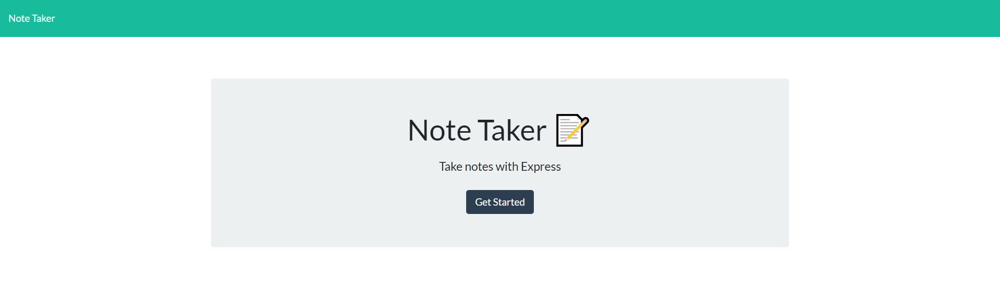
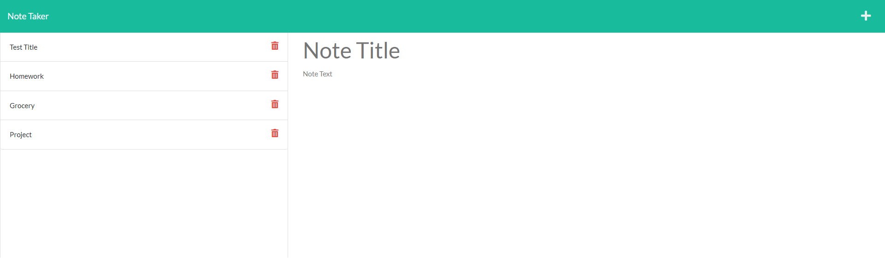

# Note-Taker
[Live Link](https://powerful-crag-77355.herokuapp.com/)

## Description

For this project we had to use express.js to work with a database on the backend and connect it to the frontend. We were able to get data from a db.json file and display it on the page. We were able to take a user input for the note title and note text and save it into the db.json file and then post it to the left column when user clicks on the save button in the navbar. When a user clicks on one of the saved notes in the left hand column, the note title and note text in the right column will display the contents of that note. We used uuid npm package to give each note a unique id when it is created. We also used the express.js delete method to be able to remove a note from the left hand column when a user clicks on the trash can button. We were successfully able to deploy the application on Heroku.

## Usage
This image shows the landing page of the application with a working link to display the notes page:

This image shows that the notes page will display saved notes on the left column from the database:

This image shows that when you click on a saved note on the left column, it will show the note contents on the right column:
.png)
